# HonestNFT

## Table of Contents
  - [Motivation](#motivation)
  - [Bug Bounty](#bug-bounty)
  - [Installation](#installation)
  - [Simple Tutorial](#simple-tutorial)
  - [Video Tutorial](#video-tutorial)
  - [API Endpoints](#api-references)
  - [How metadata leaks](#how-metadata-leaks)
  - [Grifted](#grifted)
  - [Grifters? Smart Money? Luck?](#grifters-or-smart-money-or-really-really-lucky-buyers)
  - [Future Work](#future-work-ideas)
  - [Contact / Social Media](#contact--social-media)
  - [Contributing](#contributing)
  - [Acknowledgements](#acknowledgements)
## Motivation

At [Convex Labs](https://www.convexlabs.xyz), we’re NFT fanatics. We believe 
that NFTs represent a revolution in the art and collectibles spaces. 
Unfortunately, as described in [Paradigm's Guide to Designing Effective NFT 
Launches], the current systems being used for NFT launches are often unfair to 
average users. Hasu and Agnihotri describe several pitfalls which can give 
sophisticated users an edge and allow such users to extract value from both 
creators and other collectors.

We have developed and deployed tools for the purpose of gaining an advantage when 
buying NFTs and we aren’t the only ones; we’ve been observing people using such 
tools for months and recently numerous paid services such as [traitsniper.com] 
have appeared. We’ve open sourced our tools, describing how we use them, and how 
to detect when someone else has used similar methods to gain an advantage in an 
NFT launch.
  
Continue reading about our motivation / background [here](https://medium.com/@convexlabs/a76143ef8ad8)

  
## Bug Bounty 

Our bug bounty program is an experimental and discretionary rewards program modeled 
after the Ethereum bug bounty program. We will give NFTs, Ether, or other prizes to 
participants who improve our codebase or find dishonest drops.
  
We are seeding our initial bug bounty pool with 100% of the profits we made trading 
NFTs with our code. We encourage others to donate to our bounty pool multisig.
  
Our Gnosis Safe Multisig: 0xa94a1B82B441DAA23890FF5eEb84a66D323Fd6c1 

Read more about our rewards program here: Coming Soon!
  
## Installation

Navigate to a directory of your choice.

1. `git clone https://github.com/Convex-Labs/honestnft-shenanigans.git`
2. `cd honestnft-shenanigans`
3. `pip install --editable .`
4. Rename `.env-example` to `.env`
5. Add your personal API keys and web3 providers to .env

**Note**: The repo takes a few minutes to install. We've provided a decent amount 
of test data so the repository is rather large.


## Simple Tutorial

1) Download metadata with [pulling.py]
2) Generate rarity rank with [rarity.py] (ranks are based off [rarity.tools] 
algorithm - we reverse engineered it)
3) Generate rarity map (scatterplot) with [rarity_map.ipynb]
5) Pull minting data with [find_minting_data.ipynb]
6) Generate ks-test scores with [ks_test.ipynb] (ignore ks-test results for drops with skewed rarity maps)
7) Tell us what you find! 


## Video Tutorial
Tutorial: https://vimeo.com/638878051


## API References

Web3 Provider: https://www.alchemy.com/ (Recommended)

Basic IPFS Endpoints: https://ipfs.github.io/public-gateway-checker/
<details>
  <summary>Note</summary>
  
  When you click one the gateways, you might be redirected to a long URL. Please note that only the hostname + /ipfs/ part is necessary.  
  E.g.  
  
  ```
  Correct: gateway.ipfs.io/ipfs/  
  Wrong: gateway.ipfs.io/ipfs/bafybeifx7yeb55armcsxwwitkymga5xf53dxiarykms3ygqic223w5sk3m#x-ipfs-companion-no-redirect  
  ```
  
  </details>
Pinata IPFS Endpoints: https://www.pinata.cloud/ (IPFS_GATEWAY in pulling.py is 
set to a public endpoint; can pull faster w Pinata)

## How metadata leaks 

### Most of the time, this works...

1) Go to contract
2) Call tokenURI
3) Paste link into browser to view metadata 


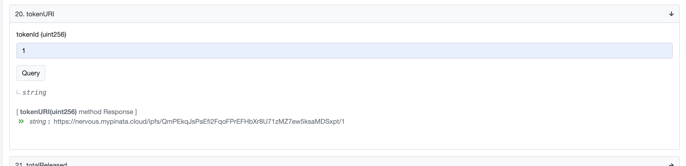
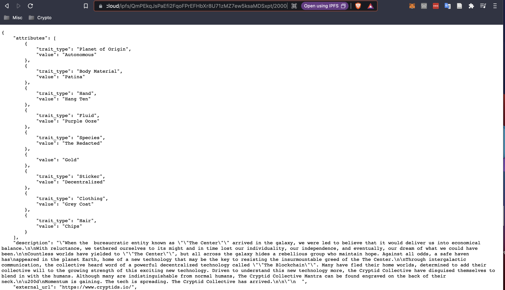

### What if metadata is hidden, but images are not?

If the explicit traits are hidden, but images are not, you can print all images 
to a directory and manually search for rare traits

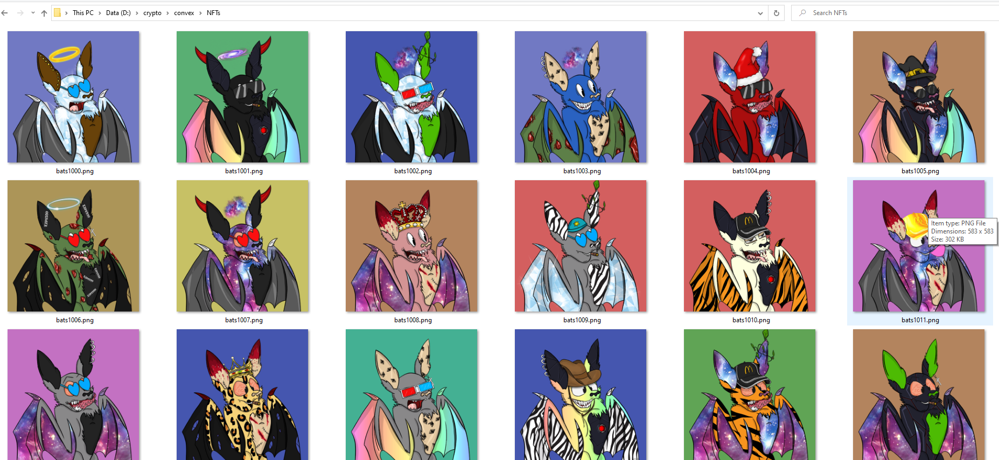
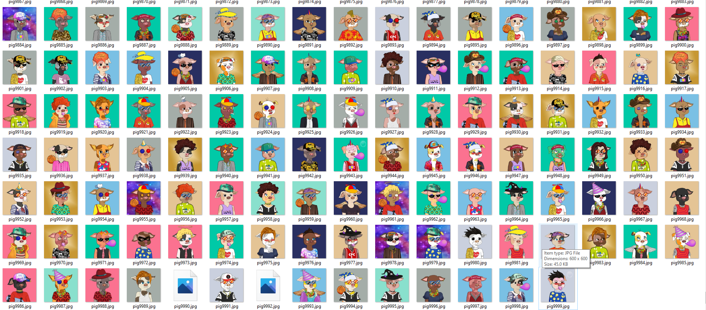

### What if the contract is not verified?

If the contract is not verified you can sometimes find the metadata url on OpenSea API
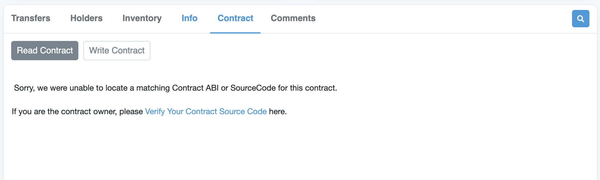
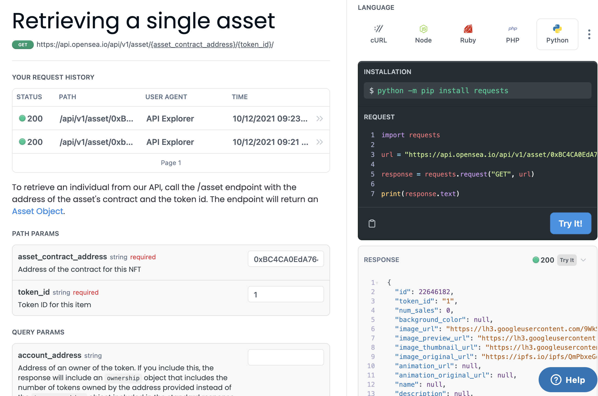


### More leaking

Sometimes data even leaks on the cloud... 
  
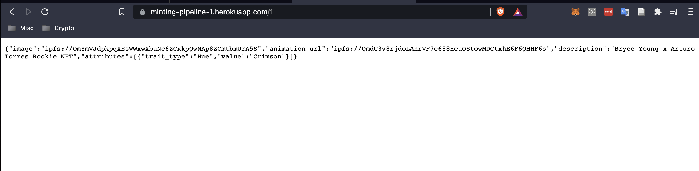


##  Weird Distributions *and* a False Positive (low rank tokens are more rare)

In the plots that follow we map the rarity of a token to its tokenID. We use the 
convention of [rarity.tools] and label more rare tokens with lower rank scores. 
For example, the rarest token in a collection has rarity rank 1. If rare tokens 
are distributed randomly throughout the collection, then rarity maps should be 
scatter plots without any discerning patterns.


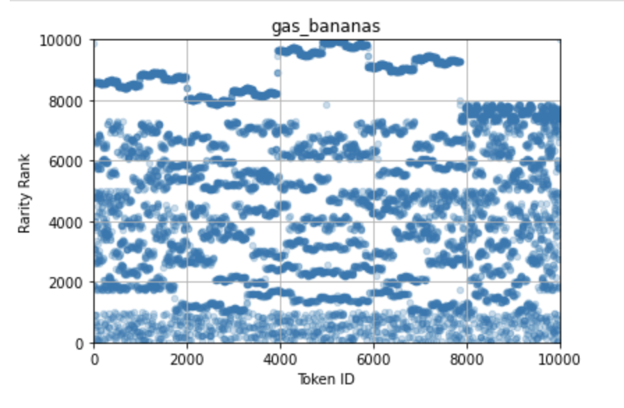
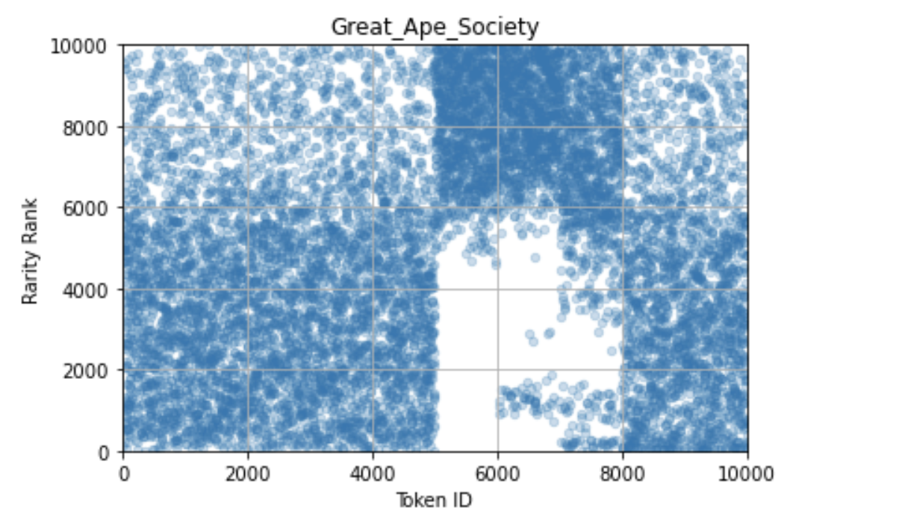
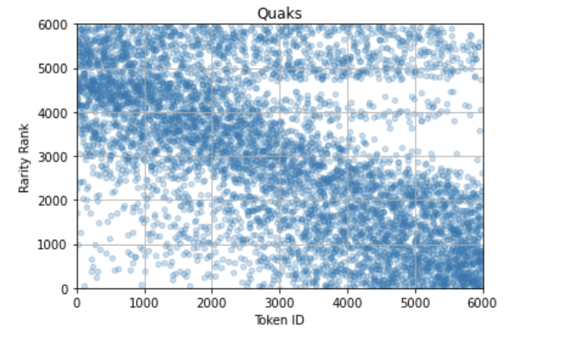
  
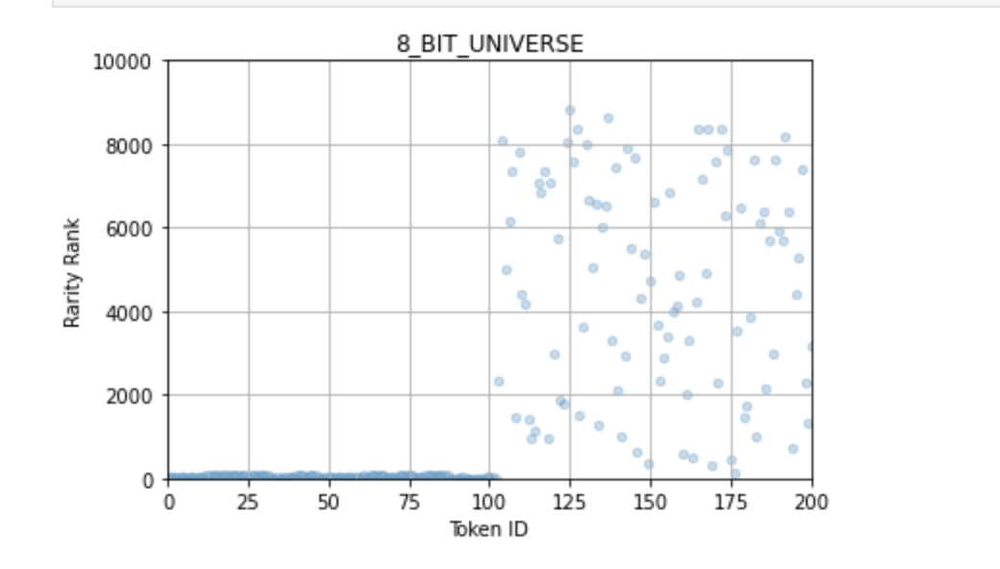

**Note**: The founders (8 Bit Universe) minted the majority of these rare tokens 
and claimed that they airdropped them to random users on Discord. Convex Labs is 
not suggesting that this statement is false, but rather that this is not 
provably verifiable. 

  
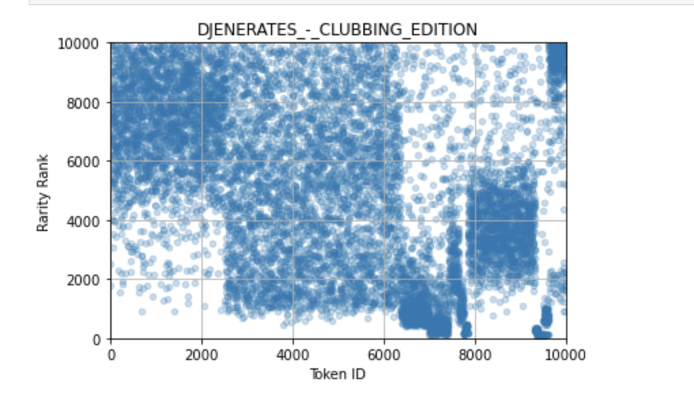

**Note**: In this case "Dejen" tokens were minted out of order in a pseudorandom 
way. Thus, taking advantage of skewed distributions is not possible in practice.

## Grifted

In the plots that follow we overlay all the mints from a single address with the 
rarity map. All mints from the address labeled in the title are shown in black. 
So, someone must be getting screwed over right? Yeah... 

We observe a clear pattern of unsuspecting minters failing to mint a single 
rare token, simply because they mint at an unfavorable time.
  
### Great Ape Society
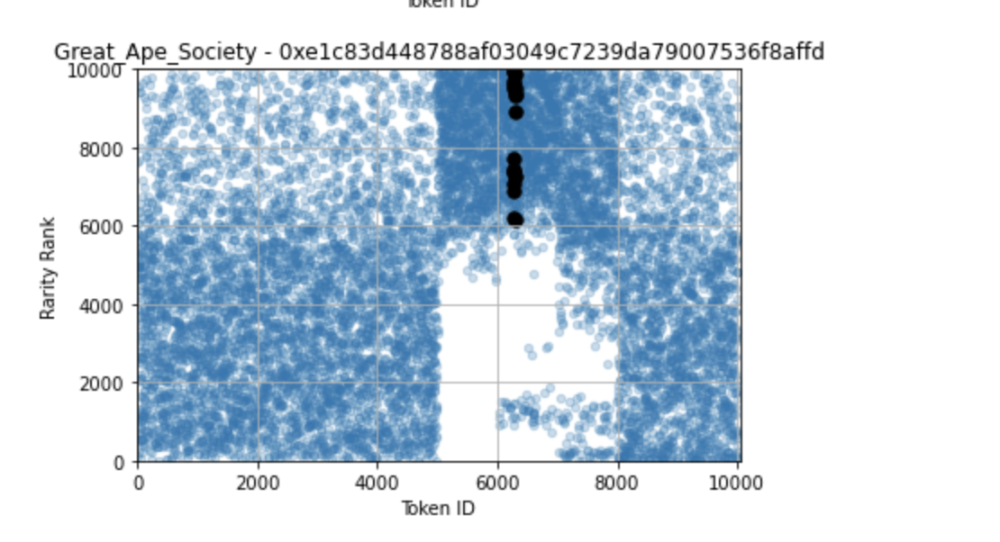
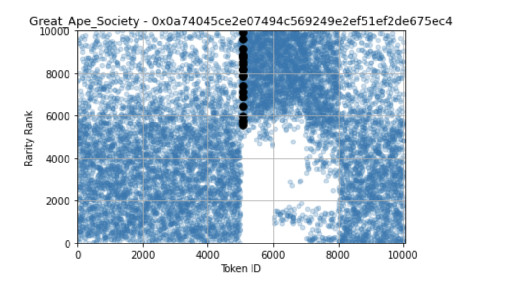
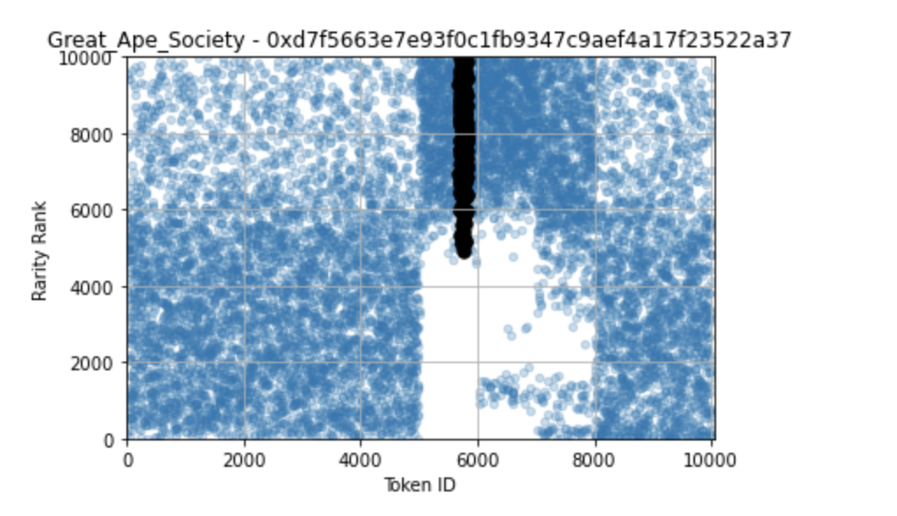

### Quaks
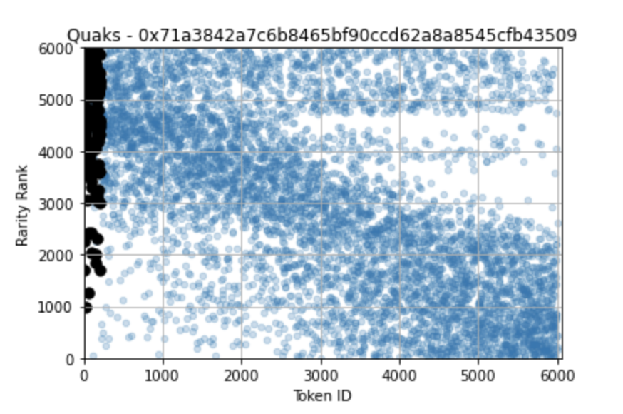
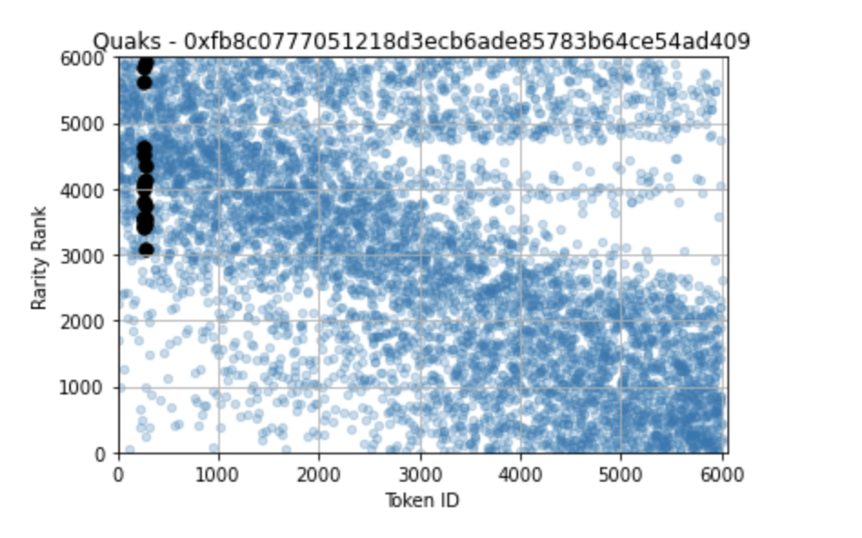

## Grifters *or* Smart Money *or* really really Lucky Buyers

With leaking metadata, insider information, or skewed distributions, some 
people must be cheating. So who are the grifters? Are these people just 
lucky? Decide for yourself...

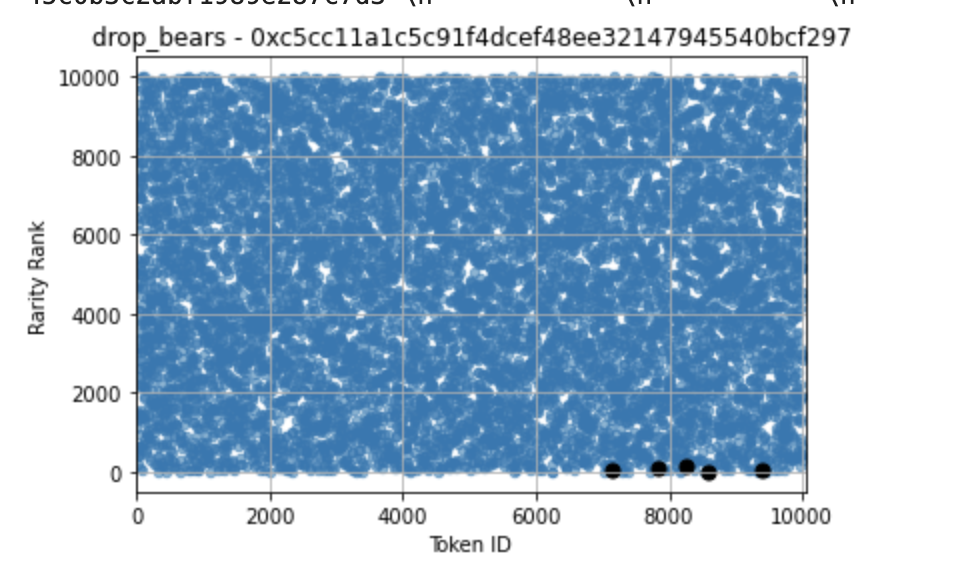
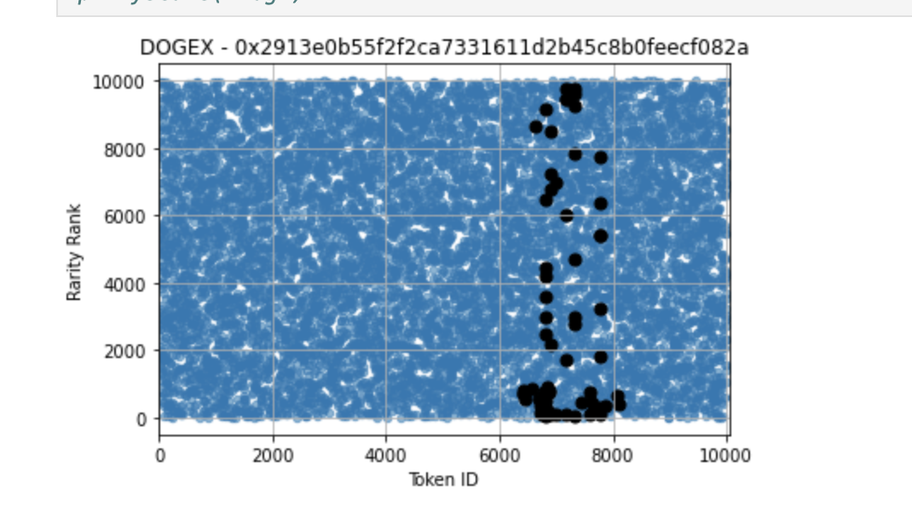
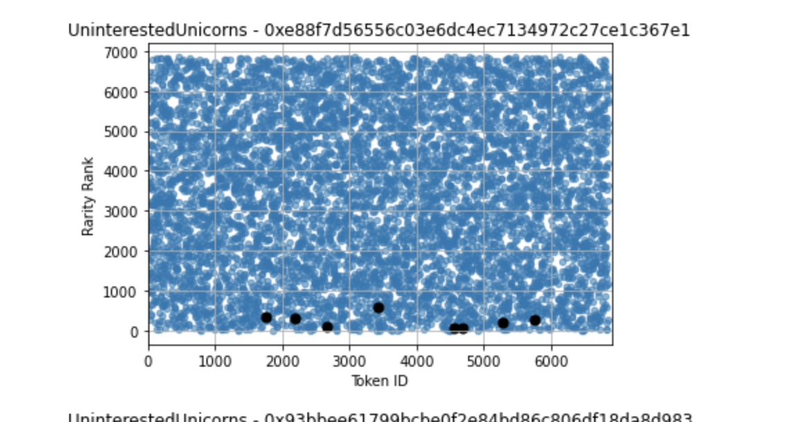

## Future Work Ideas

1) Spikes in minting before rare tokens
2) Median rarity in sliding windows of length N
3) Unusually high amounts of "1 mint" buyers getting rare tokens (ie minting 
one token and getting one rare; ks-test isn’t super sensitive to this)
4) Rare items getting listed at the same time. It is very interesting if 
multiple addresses list super rare items at the same time. Maybe these addresses 
all belong to one person?
 
## Contact / Social Media 

For help contact max@convexlabs.xyz or [@bax1337](https://twitter.com/bax1337/) on Twitter.

[Discord]  
[Website]  
[Twitter]  
 
## Contributing 

We'd love your help making these tools more robust in an effort to make the NFT 
market fair and equitable. If you find a bug or have a suggestion on how to 
improve our code, check out our [contributing guide].

## Acknowledgements
The Etherscan team for providing the free API for:
* [ArbiScan](https://arbiscan.io/)
* [BscScan](https://www.bscscan.com/)
* [Etherscan](https://etherscan.io)
* [FtmScan](https://ftmscan.com/)
* [PolygonScan](https://polygonscan.com/)
* [SnowTrace](https://snowtrace.io/)


[Paradigm's Guide to Designing Effective NFT Launches]: https://www.paradigm.xyz/2021/10/a-guide-to-designing-effective-nft-launches/
[traitsniper.com]: https://www.traitsniper.com/
[pulling.py]: https://github.com/Convex-Labs/honestnft-shenanigans/blob/master/metadata/pulling.py
[rarity.py]: https://github.com/Convex-Labs/honestnft-shenanigans/blob/master/metadata/rarity.py
[rarity.tools]: https://rarity.tools/
[rarity_map.ipynb]: https://github.com/Convex-Labs/honestnft-shenanigans/blob/master/fair_drop/rarity_map.ipynb
[find_minting_data.ipynb]: https://github.com/Convex-Labs/honestnft-shenanigans/blob/master/fair_drop/find_minting_data.ipynb
[ks_test.ipynb]: https://github.com/Convex-Labs/honestnft-shenanigans/blob/master/fair_drop/ks_test.ipynb
[Discord]: https://discord.gg/gJFw7R8bys
[Website]: https://www.honestnft.xyz/
[Twitter]: https://twitter.com/Honest_NFT
[contributing guide]: https://github.com/Convex-Labs/honestnft-shenanigans/blob/master/CONTRIBUTING.md
